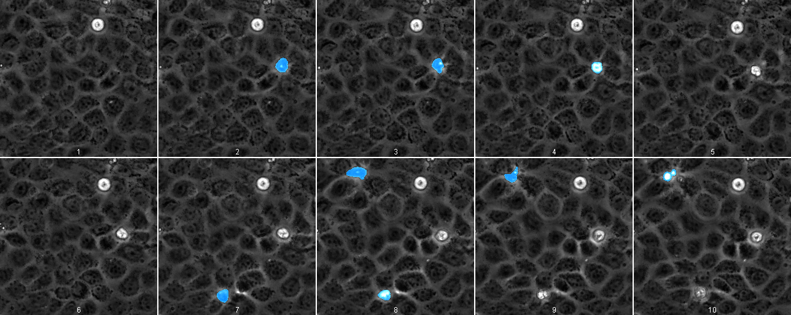

# Attention-gated residual U-Net for extrusion event detection

TensorFlow implementation of the deeply supervised attention-gated residual U-Net trained to detect extrusion events 
in time-lapse brightfield images of a cell monolayer.

***
## Overview
The quantification of extrusion events in brightfield images is a crucial component in our understanding of cellular 
dynamics. However, manually counting these events can be a laborious process. Thus, we sought to use a machine 
learning approach to detect these extrusions. A deeply supervised attention-gated residual U-Net was trained using 
Tensorflow and the output of the network is shown in the image below. Please see our [paper](https://www.biorxiv.org/content/10.1101/2022.04.01.486717v1) for full details of the 
implementation.

## Required packages
The following packages are required. Please ensure that they are installed using either pip or conda.
- tensorflow-gpu
- tensorpack
- albumentations
- tqdm
- numpy
- scipy
- scikit-image

***

## Usage
### Prerequisites
Please ensure that the [required packages](#required-packages) are installed.

### Preparing the training data
The training data consist of images consist of 5 consecutive time frames of size 128x128px. These 5 time frames can 
be broken down to the two time point before the frame of interest, the frame of interest itself, and the 
two time points after the frame of interest. The ground truth is a binary mask of size 128x128px with the extrusion 
events given a value of 1. 

### Setting up the parameters for the network
All the parameters can be set up by modifying the respective variables in [default_unet.yml](default_unet.yml). This 
will then be loaded during the initialization of the network. An additional copy is saved in the folder of the 
trained network to facilitate the recording of parameters used.

### Example
Please see [Training.ipynb](Training.ipynb) for an example of how to train the network. Please see [Prediction.ipynb](Prediction.ipynb) for an example of how to run the prediction model on the dataset. 

***
## How to cite
